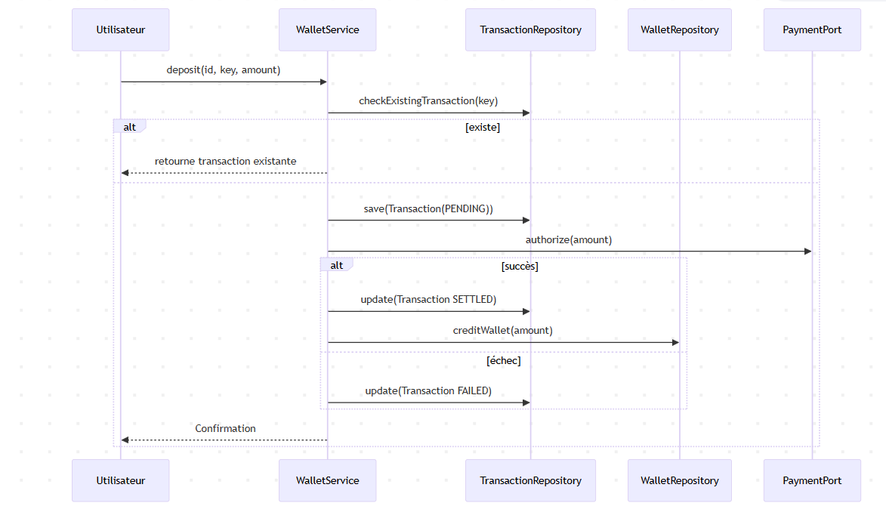
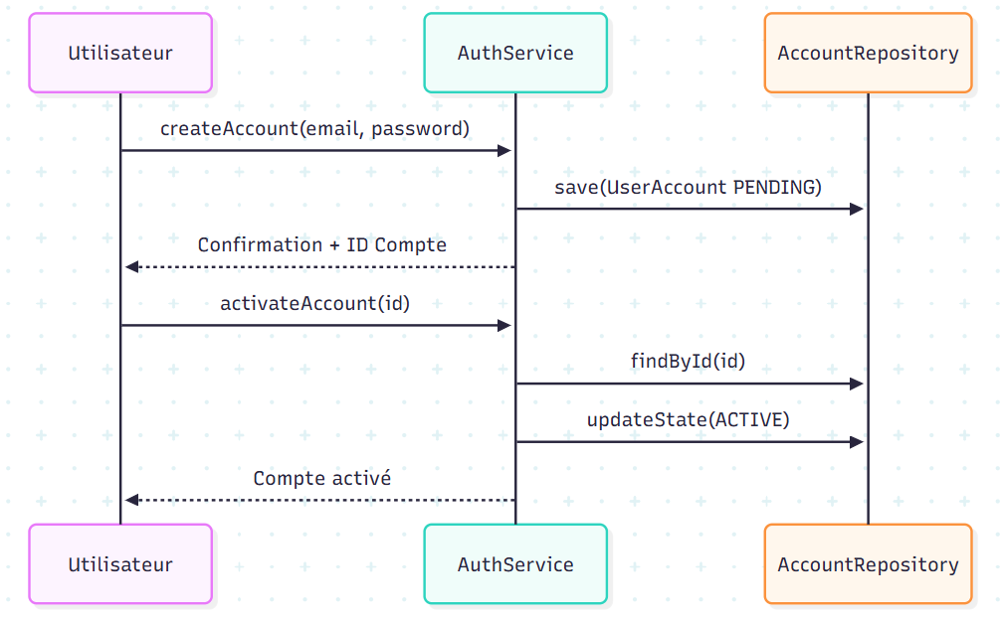
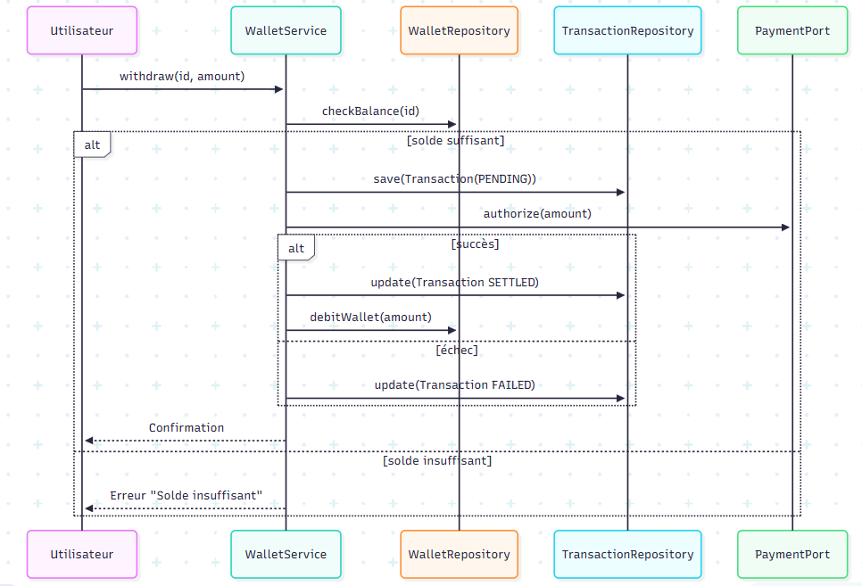

# BrokerX – ARC42 Document d’architecture

- **Auteur** : Salah Eddine Gheddas
- **Date** : 28 Septembre 2025
- **Version** : 1.0
- **Projet** : BrokerX

## 1. Introduction & Objectifs

### 1.1 Résumé exécutif
**BrokerX** est une plateforme de courtage. Il fournit : gestion des **comptes**, **wallet** par utilisateur, **transactions** (dépôts/retraits) avec **paiements**, persistance **PostgreSQL**, exécution **Docker** et pipeline **CI/CD** (GitHub Actions + runner self-hosted).

### 1.2 Objectifs
- Poser des **fondations propres et testables** (DDD + hexagonal).
- Assurer l’**intégrité** (transactions, idempotence).
- Automatiser **build/tests** + **conteneurisation** + **déploiement**.
- Préparer l’évolution (API REST, microservices, ...).

### 1.3 Parties prenantes
| Rôle | Attentes |
|---|---|
| Développeurs | maintenance, docs claires |
| Utilisateur | Opérations simples et fiables sur comptes/wallet |

### 1.4 Périmètre (Phase 1)
**Inclut** : comptes, wallet, dépôt/retrait, tests, CI/CD, Docker.
**Exclut** : UI graphique, paiements réels.

---

## 2. Contraintes

### 2.1 Techniques & organisationnelles
| Contrainte | Détail |
|---|---|
| Langage | **Java 17** |
| Persistance | **PostgreSQL** (ACID), possibilité in-memory pour MVP |
| Architecture | **Hexagonal** (Ports/Adapters) |
| Build/Test | **Maven**, **JUnit5**, **JaCoCo**, **SpotBugs** |
| CI/CD | **GitHub Actions** + **runner self-hosted** |
| Déploiement | **Docker** |

---

## 3. Contexte & Périmètre

### 3.1 Contexte (diagramme)

- Acteurs : **Utilisateur**
- Systèmes : **BrokerX**, **PostgreSQL**.

### 3.2 Cas d’utilisation

- **CU-1** Inscription/Activation compte
- **CU-2** Dépôt sur wallet (**idempotent**)
- **CU-3** Retrait (solde suffisant)
- **CU-4** Consultation solde/historique

### 3.3 Priorisation MoSCoW

| Priorité   | Cas d’utilisation                                             |
| ---------- | ------------------------------------------------------------- |
| **Must**   | **CU-01 – Inscription & Vérification d’identité**             |
| **Must**   | **CU-02 – Authentification & MFA**                            |
| **Must**   | **CU-03 – Approvisionnement du portefeuille (dépôt virtuel)** |
| **Should** | CU-04 – Abonnement aux données de marché                      |
| **Should** | CU-05 – Placement d’un ordre (marché/limite)                  |
| **Could**  | CU-06 – Modification/Annulation d’un ordre                    |
| **Could**  | CU-07 – Appariement interne & Exécution                       |
| **Won’t**  | CU-08 – Notifications & Confirmation en temps réel            |

### 3.4 Cas d'utilisation 'Must' détaillés

**CU-01 — Inscription & Vérification d’identité**

L’utilisateur accède à la page d’inscription et fournit ses informations personnelles (nom, email, mot de passe, date de naissance). Le système valide les champs, crée un compte en état Pending et envoie un lien ou un code OTP par email/SMS. Lorsque l’utilisateur confirme, le système passe le compte à l’état Active, journalise l’opération (horodatage et empreinte des documents) et permet la connexion.
Alternatifs : si l’email n’est pas confirmé, le compte reste en attente et expire après X jours ; si l’email/téléphone est déjà utilisé, le système propose la récupération de compte.
Critère d’acceptation : après confirmation, le statut passe à Actif et l’utilisateur peut se connecter.

**CU-02 — Authentification & MFA**

L’utilisateur se connecte en saisissant son identifiant et son mot de passe. Le système vérifie les informations et, si MFA est activé, envoie un code OTP par SMS/TOTP. L’utilisateur saisit le code valide, le système émet un jeton de session (JWT) et enregistre l’événement d’audit.
Alternatifs : si MFA échoue trois fois, le compte est temporairement verrouillé ; si le compte est suspendu, l’accès est refusé et le support est contacté.
Critère d’acceptation : une session valide est créée et un jeton de connexion est généré.

**CU-03 — Approvisionnement du portefeuille virtuel**

Un utilisateur actif choisit de déposer un montant en monnaie virtuelle. Le système valide les limites (min/max, anti-fraude), crée une transaction en état Pending, puis le service de paiement simulé répond Settled. Le portefeuille de l’utilisateur est crédité, l’opération journalisée et une notification est envoyée.
Alternatifs : en cas de paiement asynchrone, le solde est crédité après confirmation ; en cas de rejet, l’état passe à Failed et l’utilisateur est notifié.
Critère d’acceptation : le solde du portefeuille augmente du montant demandé et une écriture comptable est ajoutée au journal immuable.

---

## 4. Stratégie de solution

### 4.1 Principes
- **DDD + Hexagonal** : domaine pur, ports (interfaces), adapters (infra).
- **Idempotence** : clé d’idempotence sur dépôts.
- **Transactions** : unité atomique (PostgreSQL).

### 4.2 Alternatives & raisons
- Postgres → (ACID, tooling).
- Mono-module Maven (MVP) → facilite CI/CD; modul.

---

## 5. Vue des Blocs de Construction

### 5.1 Niveau 1 – Macro-blocs

### 5.2 Niveau 2 – Détails par couche
- **Application** : `AuthService`, `WalletService`.
- **Domaine** : `UserAccount (AccountState)`, `Wallet`, `Transaction`.
- **Ports** : `AccountRepository`, `WalletRepository`, `TransactionRepository`, `PaymentPort`.
- **Adapters** : `InMemoryRepository`, `PaymentAdapter`

### 5.3 Mapping UC → composants
| UC | Services | Ports |
|---|---|---|
| Inscription/Activation | `AuthService` | `AccountRepository` |
| Dépôt | `WalletService` | `WalletRepository`, `TransactionRepository`, `PaymentPort` |
| Retrait | `WalletService` | idem |
| Consultation | `WalletService` | `WalletRepository`, `TransactionRepository` |

---

## 6. Vue d’exécution

### 6.1 Séquence – UC Dépôt

### 6.2 Séquence – UC Inscription & Activation

### 6.3 Séquence – UC Retrait

---

## 7. Vue de déploiement

### 7.1 Architecture de Déploiement

## 8. Concepts transversaux

### 8.1 Qualité & sécurité
- **Hash mot de passe** : `SHA-256` (MVP)
- **Validation** : montants > 0, emails non vides, états valides.
- **Erreurs** : exceptions métier (solde insuffisant, compte inexistant).
- **Logs** : `stdout` (MVP)

### 8.2 Persistance & intégrité
- Agrégats : `Wallet` (racine) avec `Transaction` (consistance via service).
- **Idempotence** par `idempotencyKey` (unique par wallet + montant).
- Contrainte DB : index unique `(wallet_id, idempotency_key)`.

---

## 9. Décisions d’architecture (ADR)

- **ADR-001 – Architecture Hexagonale**
- Contexte : besoin de découplage fort.
- Décision : ports `*Repository`, `PaymentPort`

- **ADR-002 – PostgreSQL**
- Contexte : transactions ACID, outillage.
- Décision : PostgreSQL.

- **ADR-003 – CI/CD GitHub Actions + runner self‑hosted**
- Contexte : VM campus via VPN; accès direct impossible depuis cloud.
- Décision : runner local, jobs `build → tests → deploy`.

- **ADR-004 – Idempotence dépôts**
- Contexte : éviter double-crédits lors de retries.
- Décision : `idempotencyKey` + contrainte unique (DB).

- **ADR-005 – Hash SHA‑256 (MVP)**
- Contexte : simplicité en Phase 1.
- Décision : SHA‑256 maintenant

---

## 10. Exigences de qualité

### 10.1 Arbre de qualité (diagramme)

### 10.2 Scénarios de qualité (4+1 – scénarios)
| ID | Scénario | Critère d’acceptation |
|---|---|---|
| Q1 | **Idempotence dépôt** : même requête avec la même clé | 1 seule transaction `SETTLED`, solde +X une seule fois |
| Q2 | **Récupération en cas d’échec paiement** | Statut `FAILED`, aucun impact sur le solde |
| Q4 | **Sécurité mots de passe** | toujours hashés |
| Q5 | **Testabilité** | `mvn verify` vert, **couverture ≥ 60%** |

### 10.3 Pyramide de tests

---

## 11. Risques & Dette technique

| Risque/Dette | Impact | Mitigation |
|---|---|---|
| Paiements mockés | Tests peu représentatifs | Adapter REST |
| SHA‑256 au lieu de bcrypt | Faible robustesse | Passer à **bcrypt** |
| Pas encore de REST | Démo limitée | Ajout contrôleur /health puis endpoints UC |
| Pas de migration DB | Risque schéma non versionné | Intégrer Flyway/Liquibase Phase 2 |
| Couverture < 60% | Régression possible | Étendre tests, seuil JaCoCo dans CI |
| Logs non structurés | Debug plus difficile | JSON logs|

---

## 12. Glossaire

| Terme | Définition |
|---|---|
| **Compte (UserAccount)** | Identité utilisateur + état (`PENDING`, `ACTIVE`, `SUSPENDED`) |
| **Wallet** | Portefeuille associé à un utilisateur, contient un **solde** |
| **Transaction** | Mouvement de fonds (`CREDIT`/`DEBIT`) avec `PENDING/SETTLED/FAILED` |
| **IdempotencyKey** | Clé qui garantit que plusieurs tentatives d’un même dépôt ne sont appliquées **qu’une fois** |
| **Port/Adapter** | Interface (port) & implémentation technique (adapter) – pattern hexagonal |
| **MVP** | Prototype minimal démontrant le flux principal |
| **CI/CD** | Intégration & Déploiement continus |
| **ADR** | Architecture Decision Record (décisions documentées) |

---

