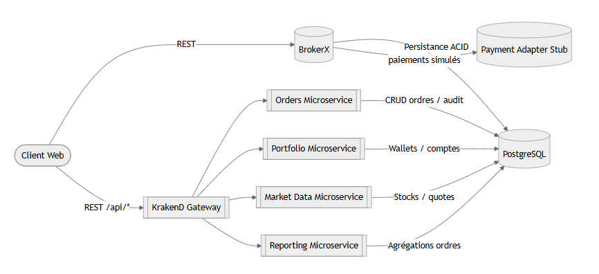
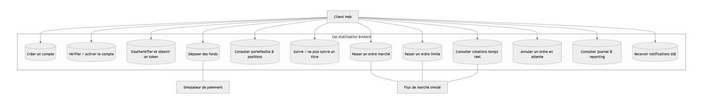
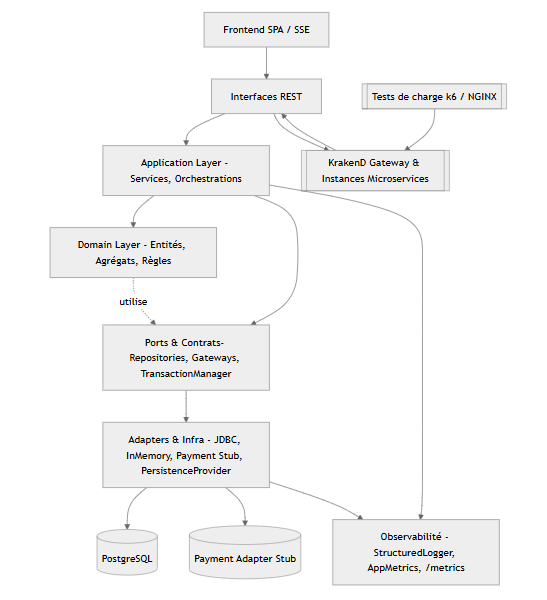
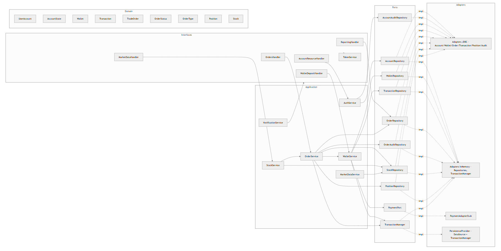

# BrokerX — Documentation ARC42

- **Auteur** : Salah Eddine Gheddas  
- **Date** : 26 octobre 2025  
- **Version** : 2.0  
- **Projet** : BrokerX – Plateforme de courtage pour investisseurs particuliers

---

## 1. Introduction & Objectifs

### 1.1 Résumé exécutif
**BrokerX** est une plateforme de courtage couvrant l’inscription client, la vérification KYC, l’alimentation d’un portefeuille virtuel, la consultation de cotations, la passation et l’annulation d’ordres boursiers (marché / limite), ainsi qu’un reporting synthétique. L’application est disponible en mode monolithique (serveur HTTP unique + SPA) et en mode microservices REST (orders, portfolio, market-data, reporting) exposés derrière une passerelle KrakenD.

### 1.2 Objectifs
- Offrir une expérience complète de courtage .  
- Sécuriser les fonds virtuels via transactions ACID + idempotence.  
- Exposer une API REST homogène, versionnée et instrumentée.  
- Préparer la transition microservices + gateway avec capacités d’observabilité.  
- Mettre en place des workflows de tests automatisés (unitaires, intégration JDBC, scénarios k6).

### 1.3 Parties prenantes
| Rôle | Attentes |
|---|---|
| Développeurs | maintenance, docs claires |
| Utilisateur | Opérations simples et fiables sur comptes/wallet |

### 1.4 Périmètre (phase actuelle)
**Inclut** : parcours d’inscription + activation, dépôts idempotents, wallet, ordres (market/limit + annulation), positions, reporting global, interfaces REST (monolithe + microservices), observabilité, cache, artefacts de charge (k6) et passerelle KrakenD.  
**Exclut** : paiements réels, authentification forte multi-facteurs externe, connexion bourses réelles, règlement-livraison réel, support mobile natif.

---

## 2. Contraintes

### 2.1 Techniques & organisationnelles
| Contrainte | Détail |
| --- | --- |
| Langage / Runtime | Java 17, JVM HotSpot |
| Build & Tests | Maven 3.9, JUnit 5, JaCoCo, SpotBugs |
| Architecture | Hexagonale (ports/adapters) + option microservices REST |
| Persistance | PostgreSQL 15, repli H2 pour tests |
| Sécurité | Hash SHA-256 (MVP), Bearer token interne (TokenService), CORS |
| Observabilité | Prometheus `/metrics`, logs JSON structurés |
| Containers | Docker / Docker Compose |
| Gateway | KrakenD 2.x (REST), NGINX pour LB côté edge |
| CI/CD | GitHub Actions (runner self-hosted) |

---

## 3. Contexte & Périmètre

### 3.1 Contexte (diagramme)

- Acteurs : **Utilisateur**
- Systèmes : **BrokerX**, **PostgreSQL**.

### 3.2 Cas d’utilisation

### 3.3 Priorisation MoSCoW

| Priorité   | Cas d’utilisation                                             |
| ---------- | ------------------------------------------------------------- |
| **Must**   | **CU-01 – Inscription & Vérification d’identité**             |
| **Must**   | **CU-02 – Authentification & MFA**                            |
| **Must**   | **CU-03 – Approvisionnement du portefeuille (dépôt virtuel)** |
| **Should** | CU-04 – Abonnement aux données de marché                      |
| **Should** | CU-05 – Placement d’un ordre (marché/limite)                  |
| **Could**  | CU-06 – Modification/Annulation d’un ordre                    |
| **Could**  | CU-07 – Appariement interne & Exécution                       |
| **Won’t**  | CU-08 – Notifications & Confirmation en temps réel            |

### 3.4 Cas d'utilisation 'Must' détaillés

**CU-01 — Inscription & Vérification d’identité**

L’utilisateur accède à la page d’inscription et fournit ses informations personnelles (nom, email, mot de passe, date de naissance). Le système valide les champs, crée un compte en état Pending et envoie un lien ou un code OTP par email/SMS. Lorsque l’utilisateur confirme, le système passe le compte à l’état Active, journalise l’opération (horodatage et empreinte des documents) et permet la connexion.
Alternatifs : si l’email n’est pas confirmé, le compte reste en attente et expire après X jours ; si l’email/téléphone est déjà utilisé, le système propose la récupération de compte.
Critère d’acceptation : après confirmation, le statut passe à Actif et l’utilisateur peut se connecter.

**CU-02 — Authentification & MFA**

L’utilisateur se connecte en saisissant son identifiant et son mot de passe. Le système vérifie les informations et, si MFA est activé, envoie un code OTP par SMS/TOTP. L’utilisateur saisit le code valide, le système émet un jeton de session (JWT) et enregistre l’événement d’audit.
Alternatifs : si MFA échoue trois fois, le compte est temporairement verrouillé ; si le compte est suspendu, l’accès est refusé et le support est contacté.
Critère d’acceptation : une session valide est créée et un jeton de connexion est généré.

**CU-03 — Approvisionnement du portefeuille virtuel**

Un utilisateur actif choisit de déposer un montant en monnaie virtuelle. Le système valide les limites (min/max, anti-fraude), crée une transaction en état Pending, puis le service de paiement simulé répond Settled. Le portefeuille de l’utilisateur est crédité, l’opération journalisée et une notification est envoyée.
Alternatifs : en cas de paiement asynchrone, le solde est crédité après confirmation ; en cas de rejet, l’état passe à Failed et l’utilisateur est notifié.
Critère d’acceptation : le solde du portefeuille augmente du montant demandé et une écriture comptable est ajoutée au journal immuable.

---

## 4. Stratégie de solution

### 4.1 Principes directeurs
- **Hexagonal** : domaine pur (`domain/*`), services applicatifs (`application/*`), ports (`ports/*`), adaptateurs (`adapters/*`).  
- **Transactions & Idempotence** : Flyway + contraintes uniques, `TransactionManager`, `idempotencyKey`.  
- **REST uniforme** : `/api/v1/*` pour monolithique, `/orders`, `/wallets`, `/stocks`, `/reports` pour microservices.  
- **Observabilité** : logs structurés (`StructuredLogger`), métriques Prometheus (`AppMetrics`), traces manuelles.  
- **Scalabilité** : caches mémoire (quotes), load balancing (NGINX / KrakenD hosts multiples), tests de charge.  
- **Documenter** : arc42, ADRs, README, openapi/postman.

### 4.2 Alternatives évaluées
- REST servlet vs HttpServer : choix `com.sun.net.httpserver.HttpServer` pour légèreté, instrumentation facile.
- WebSockets vs SSE : SSE suffisant pour flux unidirectionnels (quotes & notifications).
- API Gateway : KrakenD vs Spring Gateway — KrakenD retenu (configuration JSON, stateless).  
- Microservices vs modularisation interne : processus séparés pour démonstration, réutilisant le noyau (pas encore scindé en modules Maven).

### 4.3 Découpage fonctionnel
- **Domaine** : `account`, `wallet`, `order`, `stock`, `position`.  
- **Application** : `AuthService`, `WalletService`, `OrderService`, `StockService`, `MarketDataService`, `NotificationService`.  
- **Infra** : adaptateurs PostgreSQL (`adapters.persistence.jdbc`), mémoire (`adapters.persistence.memory`), `PaymentAdapterStub`, `PersistenceProvider`.  
- **Interfaces** : REST monolithique (`interfaces.rest`), REST microservices (`interfaces.rest.microservices`), SPA (`resources/public`), SSE.  
- **Observabilité** : `observability/` (metrics, logging), `infra/` (gateway, nginx), `load-testing/`.

---

## 5. Vue des blocs de construction

### 5.1 Niveau 1 – Macro composants
| Bloc | Description | Interactions clés |
| --- | --- | --- |
| SPA (HTML/JS) | Interface unique (login, dashboard, ordres, stocks) | REST JSON + SSE |
| Monolith Server | HttpServer + REST `/api/v1/*`, SSE `/api/v1/stream` | Services applicatifs, persistence |
| Microservices | ORDERS / PORTFOLIO / MARKETDATA / REPORTING | Réutilisent services/app + repos |
| Persistence | PostgreSQL + Hikari, Flyway migrations V1..V3 | Contrainte ACID, audit |
| Gateway | KrakenD (`infra/gateway/krakend.json`) | LB, CORS, quotas |
| Observabilité | `/metrics`, structured logs, Grafana dashboards | Prometheus scrape |

### 5.2 Niveau 2 – Couches internes (hexagonale)
- **Domain** : `UserAccount`, `Wallet`, `Transaction`, `TradeOrder`, `Position`, `Stock`.  
- **Application** : `AuthService` (KYC + tokens), `WalletService` (dépôt, débit, refund), `OrderService` (contrôles pre-trade, matching simplifié, audit), `StockService` (quotes + cache).  
- **Ports** : `AccountRepository`, `WalletRepository`, `TransactionRepository`, `OrderRepository`, `PositionRepository`, `StockRepository`, `OrderAuditRepository`, `PaymentPort`, `TransactionManager`.  
- **Adapters** :  
  - JDBC (`adapters.persistence.jdbc.*`) — connecteurs PostgreSQL/Hikari.  
  - In-memory (`adapters.persistence.memory.*`) — scénarios tests/monde isolé.  
  - REST handlers (`interfaces.rest.*`) — monolithique & microservices.  
  - Observabilité (`observability.*`) — logger + métriques.  
- **Bootstrap** : `Application` (monolithe), `ServiceLauncher` (microservices), `PersistenceProvider` (abstraction DataSource).

### 5.3 Mapping UC → composants
| Cas d’utilisation | Services | Ports/Adapters | Interfaces |
| --- | --- | --- | --- |
| Inscription & activation | `AuthService` | `AccountRepository`, `AccountAuditRepository`, `WalletRepository` | REST `/api/v1/accounts`, SPA |
| Dépôt portefeuille | `WalletService` | `WalletRepository`, `TransactionRepository`, `PaymentPort`, `TransactionManager` | REST `/api/v1/wallets/{id}/deposits`, microservice portfolio |
| Ordre marché/limite | `OrderService`, `MarketDataService`, `WalletService`, `StockService` | `OrderRepository`, `StockRepository`, `OrderAuditRepository`, `PositionRepository` | REST `/api/v1/orders`, microservice orders |
| Annulation | `OrderService`, `WalletService` | mêmes ports | REST `/api/v1/orders/{id}/cancel` |
| Données de marché | `StockService`, `MarketDataService` | `StockRepository` | REST `/api/v1/stocks`, SSE, microservice marketdata |
| Reporting | `OrderService` (lecture), `OrderRepository` | `OrderRepository`, `OrderAuditRepository` | REST `/api/v1/reports/orders/summary`, microservice reporting |

---

## 6. Vue d’exécution

### 6.1 Sécquence – Inscription & Vérification d’identité

### 6.2 Sécquence – Authentification & MFA

### 6.3 Sécquence – Approvisionnement du portefeuille

### 6.4 Sécquence – Abonnement aux données de marché

### 6.5 Sécquence – Placement d’un ordre (marché/limite) avec contrôles pré-trade

---

## 7. Vue de déploiement

### 7.1 Architecture de Déploiement

### 7.2 Vérification de test et déploiement

---

## 8. Concepts transversaux

### 8.1 Sécurité
- Hash SHA-256 (MVP) + pepper applicative.  
- Tokens Bearer (TokenService) valides 4h, option `BROKERX_REQUIRE_TOKEN`.  
- CORS permissif côté Gateway ; Authorization + Content-Type exigés pour endpoints sensibles.  
- Validation stricte des payloads (montants > 0, quantités positives, limite dans bande ±50 %).  
- Rejets explicites (`RestException`), JSON d’erreur normalisé (`ApiError`).  
- Logs structurés pour détection anomalies (`wallet_balance_insufficient`, `order_event`).  

### 8.2 Persistance & intégrité
- Contrainte unique `idx_orders_client_unique` (idempotence par `client_order_id`).  
- Positions recalculées en temps réel (debit/credit) + moyenne pondérée.  
- Transactions wallet : `TransactionManager` assure rollback sur erreur (réservations ordres).  
- Audit : `account_audit`, `order_audit` (append-only).  

### 8.3 Observabilité & performance
- Métriques custom : `brokerx_http_requests_total`, `brokerx_orders_total`, `brokerx_wallet_deposits_total`, histogrammes latence.  
- Logs JSON pour ingestion ELK/Graylog.  
- Caching quotes (TimedCache TTL 1s) + invalidation follow/unfollow.  
- KrakenD micro-cache 5s sur `/api/stocks`, circuit breaker reporting.  
- Tests k6 : profils navigation + ordres, saturation, montée en charge horizontale.  

### 8.4 Frontend / UX
- SPA unique3 : login, dashboard, portefeuille, ordres, reporting.  
- SSE (Server-Sent Events) pour streamer quotes + notifications.  
- Auto-refresh balances (via SSE + UI update).  
- Réutilisation API monolithique ou Gateway selon mode.

---

## 9. Décisions d’architecture (ADR)

| ID | Titre | Décision |
| --- | --- | --- |
| ADR-001 | Style hexagonal | Ports/adapters pour isoler domaine, faciliter microservices |
| ADR-002 | Persistant PostgreSQL | ACID, tooling mature, Flyway pour migrations |
| ADR-003 | Idempotence dépôts & ordres | `idempotency_key` + contraintes uniques + transactions |
| ADR-004 | Observabilité Prometheus + logs structurés | `/metrics`, `StructuredLogger`, Golden Signals Grafana |
| ADR-005 | Gateway KrakenD | Regrouper microservices, appliquer CORS/quotas/LB sans code |
| ADR-006 | Json HttpServer (JDK) | Simplicité, contrôle complet, pas de dépendance Spring |
| ADR-007 | Caching multi-couche | TimedCache applicatif + micro-cache gateway, invalidation ciblée |
| ADR-008 | TokenService interne | Auth Bearer légère en attendant IAM externe |
| ADR-009 | Position repository | Stocker moyenne pondérée + quantités pour reporting/risques |

Chaque ADR est détaillé dans `docs/adr/`.

---

## 10. Exigences de qualité

### 10.1 Arbre de qualité

### 10.2 Attributs & scénarios
| ID | Qualité | Scénario | Mesure |
| --- | --- | --- | --- |
| Q1 | Disponibilité | Gateway + 2 instances `orders-svc`; kill d’une instance sous charge | RPS maintenu, erreurs < 1 % |
| Q2 | Performance | Monolithique + cache quotes | Latence p95 < 500 ms pour `/api/v1/orders` |
| Q3 | Observabilité | Dashboard Golden Signals | 4 métriques visibles + alertes latence |
| Q4 | Sécurité | Rejet token invalide | 401 + audit log `http_error` |
| Q5 | Intégrité | Double dépôt même idempotency key | Solde +X une seule fois, transactions 1 `SETTLED` |
| Q6 | Récupérabilité | Erreur matching (exception) | Wallet remboursé, ordre `FAILED`, audit |

### 10.3 Stratégie de tests
- **Unitaires** : domaine (wallet, transaction), services (order, wallet).  
- **Intégration** : `JdbcPersistenceIntegrationTest`, `SignupAndDepositFlowTest`.  
- **Contract** : REST DTO.  
- **Charge** : scripts k6.  
- **Manual smoke** : via SPA + KrakenD (check metrics, SSE).  
- Couverture visée > 70 %.

---

## 11. Risques & Dettes techniques

| Risque / Dette | Impact | Mitigation |
| --- | --- | --- |
| Auth simple (SHA-256, token en mémoire) | Sécurité limitée | Introduire bcrypt + stockage token/refresh + MFA |
| Sources marché simulées | Décalage vs réel | Prévoir connecteur externe, tests de cohérence |
| Shared database entre microservices | Couplage fort | Étape suivante : BDD par service, events |
| TransactionManager maison | Bugs rollback | Ajouter tests concurrency, envisager Spring Tx / JTA |
| Absence tracing distribué | Observabilité limitée | Intégrer OpenTelemetry lors passage event-driven |
| Pas de stress DB multi-instance | Inconnu sous forte charge | Tests k6 + tuning Hikari |
| Gestion devise unique (USD) | Pas d’internationalisation | Concevoir Domain Money pour extension |

---

## 12. Glossaire

| Terme | Définition |
| --- | --- |
| **Wallet** | Portefeuille cash lié à un compte, solde et transactions |
| **Transaction** | Mouvement de fonds (Pending → Settled / Failed), idempotent |
| **TradeOrder** | Ordre boursier (Market / Limit), `status` (Pending, Completed, Failed, Cancelled) |
| **Position** | Quantité / prix moyen détenus par compte et symbole |
| **Order Audit** | Historique immuable d’évènements ordre (création, exécution, annulation) |
| **Token Bearer** | Jeton d’accès interne émis par `TokenService`, TTL 4h |
| **Timed Cache** | Cache mémoire TTL 1s pour quotes / suivis |
| **Gateway** | KrakenD, point d’entrée unique pour microservices BrokerX |
| **Golden Signals** | Latence, trafic (RPS), erreurs, saturation (CPU/RAM/threads) |
| **IdempotencyKey** | Clé unique pour rejouer sans doublons dépôts/ordres |
| **SSE** | Server-Sent Events – push unidirectionnel pour quotes & notifications |

---

## 13. Run Book
1. **Préparation environnement**
   - Cloner le dépôt, installer Java 17, Maven 3.9+, Docker Desktop.
   - Copier `.env.example` vers `.env` et ajuster les variables (`BROKERX_DB_URL`, `BROKERX_SERVICE`, etc.).
2. **Base de données**
   - Lancer PostgreSQL (`docker compose up db -d`) ou utiliser l’instance fournie.public;` en cas d’incohérence Flyway.
3. **Build & tests**
   - `mvn clean verify` (exécute unitaires, intégration JDBC, JaCoCo).
4. **Lancement**
   - `java -jar target/brokerx-0.0.1-SNAPSHOT.jar`.
   - Interface web : `http://localhost:8080`.

---
## 14. Guide d’utilisation
1. **Connexion**
   - Ouvrir `http://localhost:8080`.
   - Cliquer « Créer un compte », remplir les champs requis, récupérer le code OTP affiché, valider.
   - Se connecter via la page de login.
2. **Alimenter le portefeuille**
   - Depuis le tableau de bord, saisir un montant dans « Déposer des fonds ».
   - Le solde et le journal s’actualisent en temps réel.
3. **Suivre des stocks**
   - Onglet « Stocks » : consulter la liste, cliquer « Suivre »/« Ne plus suivre ».
   - Les cotations se mettent à jour via SSE (prix + timestamp).
4. **Passer un ordre**
   - Depuis le module « Ordres », choisir symbole, type (Market/Limit), quantité, prix limite si nécessaire.
   - Envoyer l’ordre : la SPA affiche le statut (Completed/Pending/Failed) et le journal se met à jour.
   - Pour annuler un ordre en attente, utiliser le bouton « Annuler » dans la section « Activités récentes ».
---
